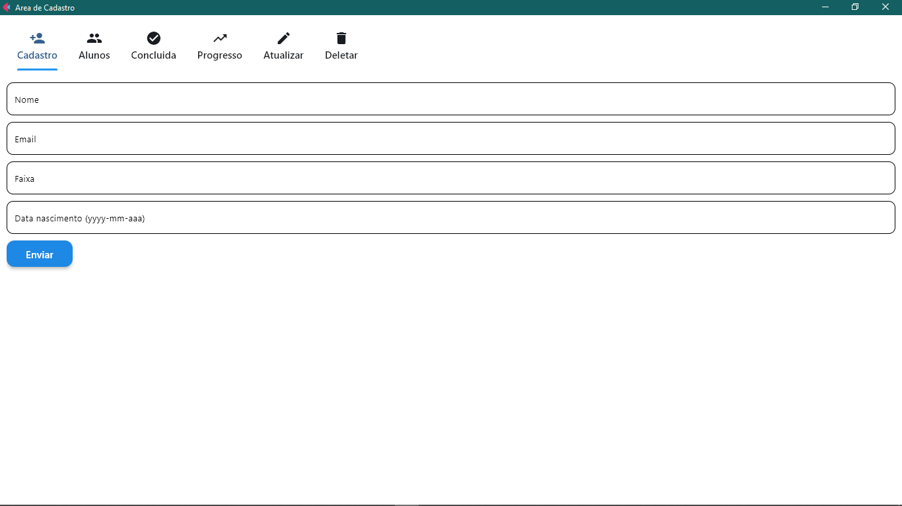

📌 Área de Gerenciamento e Cadastro de Alunos de Artes Marciais

🚀 Descrição:
Este projeto é um sistema de gerenciamento para academias de artes marciais, permitindo:
✅ Cadastro de alunos
✅ Listagem de alunos
✅ Registro de aulas concluídas
✅ Verificação de progresso
✅ Atualização e exclusão de dados

💻 Tecnologias Utilizadas:
Frontend: Python, Django, Flet, Requests
Backend: Python, Django Ninja, REST API
Banco de Dados: MySQL

📬 Contato: Caso tenha dúvidas, entre em contato! 🚀

Email: barbosa.nilsonneto@gmail.com
X: @Nilsonbarbozza
Whatsapp: (084) 9970-0898

